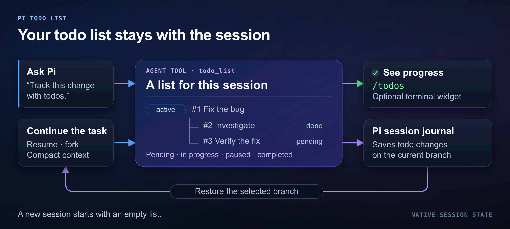

# Pi Todo List

Pi Todo List gives your [Pi](https://github.com/earendil-works/pi) agent a nested todo list. Use it to check task progress from the Pi terminal.



## Install and start

Use Pi 1.0.0 or later and Node.js 24 or later. Official Pi releases and the maintained fork both support this extension.

```bash
pi install git:github.com/fitchmultz/pi-todo-list
pi
```

Ask Pi to track a task:

> Use todo_list to track this task and its subtasks.

Type `/todos` to check progress. Read the [tool reference](docs/reference.md) for actions and batch examples.

## Terminal controls

| Command | Result |
| --- | --- |
| `/todos` | Open todo items and status counts, up to 100 rows |
| `/todos 3` | Item #3's status, parent, and detail link, even when completed |
| `/todos all` | Open and completed todo items, up to 100 rows |
| `/todos show` | Show the widget, with up to eight open todo items |
| `/todos hide` | Hide the widget |
| `/todos toggle` | Switch widget visibility |

Pi hides the widget at startup. For open todo items, the footer shows active and pending counts. It also shows paused counts when present.

Run Pi with this setting to show the widget at startup:

```bash
PI_TODO_WIDGET=show pi
```

Ask Pi to change a todo item:

> Pause item #3 until the API credentials are available.

Use `/todos all` to find a completed item's ID. Include that ID when you ask Pi to reopen it.

## Todo items and sessions

Each todo item can be pending, in progress, paused, or completed. Pi also completes or removes subtasks when you complete or remove their parent item.

A todo item can link to a URL or note/file path. The todo list shows `[details]`; `/todos <id>` shows the link. The extension does not open the link.

Pi saves todo items in its native session journal. Pi restores them when you resume, fork, or select a session branch. Context compaction preserves the todo list. A new session starts with an empty todo list.

## Warnings

Older extension versions can save an incomplete todo list. Use version 0.10.3 or later when you open sessions from version 0.10.3. Read [journal compatibility](docs/reference.md#journal-compatibility) before a downgrade.

Corrupt history can leave an incomplete todo list. Follow the [recovery guide](docs/reference.md#manual-reconciliation-after-a-corruption-warning) before you add todo items after a corruption warning.

Pi can change the current branch before a save fails. Check the todo list before you retry a failed change.

## Details and development

From a checkout, load the extension for one Pi session:

```bash
pi -e ./extensions/todo-list.ts
```

- [Tool reference](docs/reference.md): actions, batches, detail links, recovery, and journal formats
- [Development guide](docs/development.md): local installation, tests, and compatibility checks
- [Changelog](CHANGELOG.md): release history
- [Issues](https://github.com/fitchmultz/pi-todo-list/issues): bugs and feature requests

## License

[MIT](LICENSE) · Copyright © 2026 Mitch Fultz.
